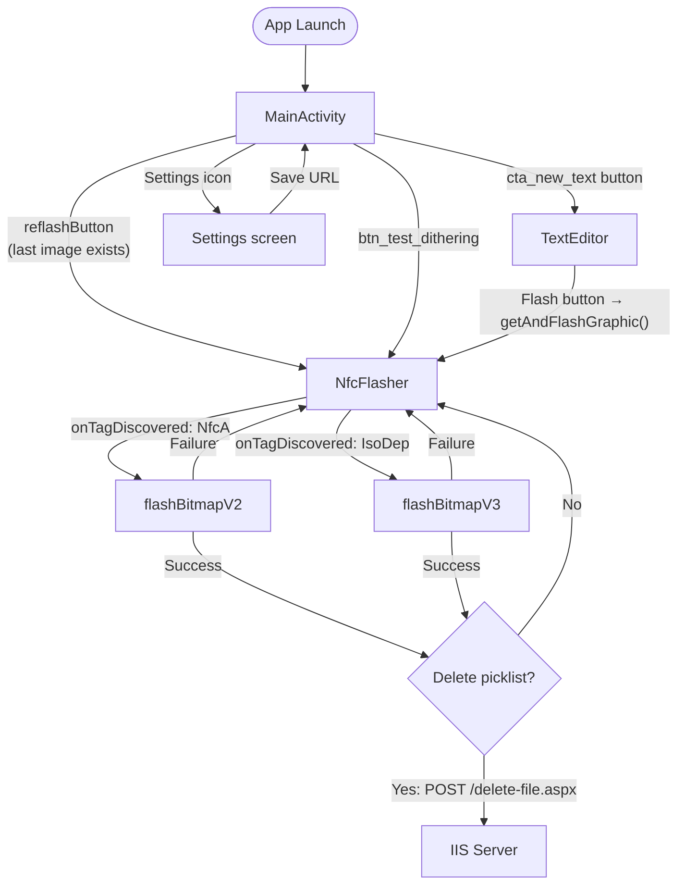
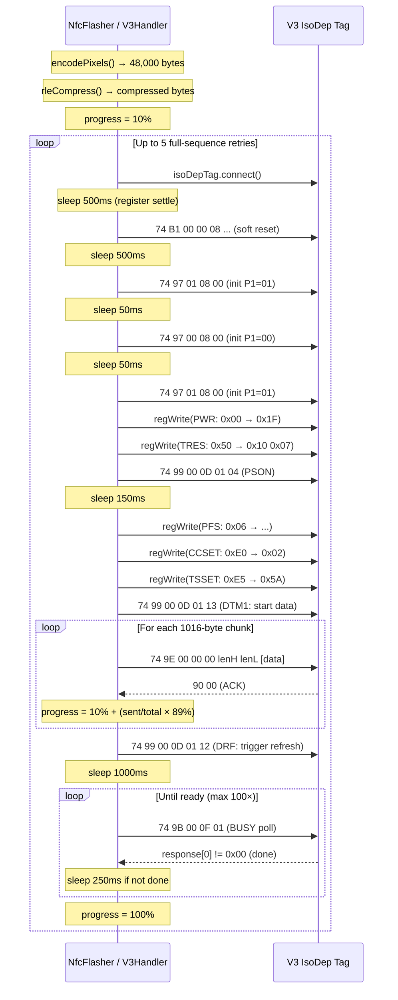
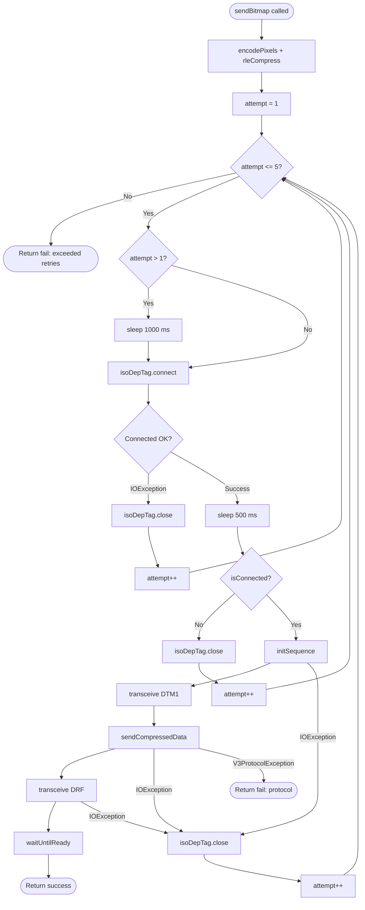
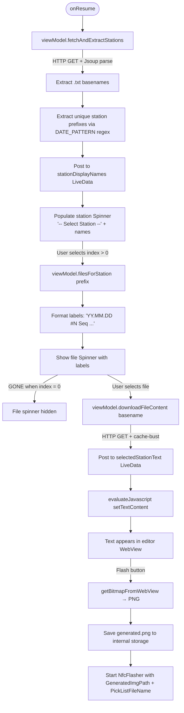
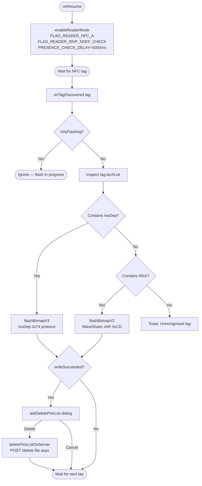

# Adient NFC Writer V2/V3 — Comprehensive Developer Documentation

> **Repository:** [ea9000/Adient-NFC-Writer-V2V3](https://github.com/ea9000/Adient-NFC-Writer-V2V3)
> **Last updated:** 2026-04-13
> **Platform:** Android (minSdk 16 / targetSdk 30 / compileSdk 33)
> **Language:** Kotlin

---

## Table of Contents

1. [Executive Summary](#1-executive-summary)
2. [Functional Specification](#2-functional-specification)
3. [Technical Specification](#3-technical-specification)
4. [Code Documentation](#4-code-documentation)
5. [Flowcharts](#5-flowcharts)
6. [Configuration & Deployment](#6-configuration--deployment)

---

## 1. Executive Summary

### Purpose

The **Adient NFC Writer** is an Android application for Zebra industrial tablets that programs Waveshare NFC-powered e-paper displays. Operators at Adient manufacturing stations select a pick-list file from an IIS web server, preview it in a text editor, and then tap the tablet to an NFC e-paper tag to write the image to the display in a single step.

### Target Hardware

| Display | Size | Resolution | NFC Protocol |
|---------|------|-----------|--------------|
| Waveshare NFC e-Paper (primary) | 7.5" | 800 × 480 px | Auto-detected (V2 or V3) |
| Waveshare NFC e-Paper | 4.2" | 400 × 300 px | Auto-detected |
| Waveshare NFC e-Paper | 7.5" HD | 880 × 528 px | Auto-detected |
| Waveshare NFC e-Paper | 2.13" | 250 × 128 px | Auto-detected |
| Waveshare NFC e-Paper | 2.9" | 296 × 128 px | Auto-detected |
| Waveshare NFC e-Paper | 2.7" | 264 × 176 px | Auto-detected |
| Waveshare NFC e-Paper | 2.9" v.B | 296 × 128 px | Auto-detected |

### V2 vs V3 Protocol Support

The app automatically detects which hardware generation the tag is at tap time:

| | V2 | V3 |
|---|---|---|
| NFC transport | NfcA (ISO 14443-3A) | IsoDep (ISO 14443-4) |
| Command prefix | `0xCD` | `0x74` |
| Implementation | Waveshare JAR (`NFC.jar`) | Custom `WaveShareV3Handler.kt` |
| Pixel encoding | Handled inside JAR | Floyd-Steinberg dithering + bit-inversion |
| Compression | None | WaveShare RLE |
| Chunk size | JAR-internal | Up to 1016 bytes per APDU |
| Retry strategy | JAR-internal | 5 full-sequence retries + per-chunk backoff |

---

## 2. Functional Specification

### 2.1 User Workflow

```
MainActivity → TextEditor → (pick station + file) → (preview in WebView) → Flash button
                                                                              ↓
                                                                         NfcFlasher
                                                                              ↓
                                                                     (tap to write)
                                                                              ↓
                                                                 Success → offer delete picklist
```

1. **MainActivity** — Launch screen. Shows the last flashed image as a re-flash shortcut. Buttons: "New Text" (opens TextEditor), "Test Dithering" (gradient test), "Re-flash" (re-sends the last generated image), Settings icon (configure IIS URL).
2. **TextEditor** — A WebView hosting a local HTML text editor (`assets/editors/text/index.html`). Two cascading drop-downs at the top allow selecting a station and a pick-list file. The selected file's text content is loaded into the editor automatically.
3. **Flash button** — Captures the WebView canvas as a PNG, saves it to internal storage (`generated.png`), then launches **NfcFlasher** with the filename and the pick-list file name to delete.
4. **NfcFlasher** — Displays the preview image. Waits for an NFC tag tap via `enableReaderMode`. Detects hardware (V2/V3) and writes the bitmap. On success, offers to delete the pick-list file from the IIS server.

### 2.2 Station Filter / Cascading Dropdowns

The **TextEditor** screen shows two `Spinner` widgets stacked vertically:

- **Spinner 1 — Station** (`spinner_stations`): populated from the IIS file listing. Each `.txt` filename is parsed to extract a *station prefix* (everything before the first date segment `_YY.MM.DD_`). Unique prefixes become station names. Underscores are replaced with spaces for display.
- **Spinner 2 — File** (`spinner_files`): hidden (`GONE`) until a station is selected. Selecting a station immediately populates this spinner with all files whose prefix matches, labelled `"YY.MM.DD #N (Seq XXXXXXXXXX-XXXXXXXXXX)"`. Selecting a file downloads its content.

The file spinner collapses to zero height (ConstraintLayout `GONE`) when not in use, so the WebView fills the remaining screen.

### 2.3 File List Fetching from IIS Web Server

The server URL is stored in `SharedPreferences` (`PrefKeys.BaseUrl`). The default placeholder shown in the settings screen is `http://localhost:8080/picklist`.

`MainViewModel.fetchAndExtractStations()`:
1. Appends `?t=<epoch-ms>` as a cache-buster.
2. Sends `GET` with `Cache-Control: no-cache, no-store` headers.
3. Parses the HTML with **Jsoup**, selecting `a[href]` elements (works with Apache, IIS, nginx, and custom directory listers — not just Apache `<pre>` format).
4. Filters for `.txt` hrefs, strips the path and extension to get bare basenames.
5. Extracts station prefixes via `DATE_PATTERN = Regex("_\\d{2}\\.\\d{2}\\.\\d{2}_")`.
6. Posts unique sorted prefixes to `stationPrefixes` LiveData.

`MainViewModel.downloadFileContent(basename)`:
1. Downloads `${baseUrl}${basename}.txt?t=<epoch-ms>`.
2. Posts the text to `selectedStationText` LiveData, which is observed by `GraphicEditorBase` and injected into the WebView via `setTextContent(...)`.

### 2.4 Text Editor and Bitmap Preview

The `TextEditor` activity hosts a **local HTML editor** served by `WebViewAssetLoader` from `assets/editors/text/index.html`. The editor surface is set to the exact pixel dimensions of the target display (`setDisplaySize(width, height)`).

A **JavaScript bridge** (`AndroidBridge`) allows the HTML "Reset" button to call `flushWhiteAndFlash()` in Kotlin — which writes a solid-white PNG to the e-paper to clear ghosting.

To capture the rendered image:
1. JS function `getImgSerializedFromCanvas()` is called, which serialises the canvas to a Base64 PNG string stored in `window.imgStr`.
2. After a 1-second settle delay, Kotlin reads `window.imgStr`, Base64-decodes it, and saves the result to `generated.png` in internal app storage.

### 2.5 NFC Flash Process

On the `NfcFlasher` screen:
- `enableReaderMode` is called with `FLAG_READER_NFC_A | FLAG_READER_SKIP_NDEF_CHECK`.
- `EXTRA_READER_PRESENCE_CHECK_DELAY = 5000 ms` prevents the NFC stack from probing the tag during transfer (which would deactivate the IsoDep layer).
- When a tag enters the field, `onTagDiscovered` fires on the NFC reader thread.
- The tag's `techList` is inspected:
  - `IsoDep` present → V3 path → `flashBitmapV3()`
  - `NfcA` present → V2 path → `flashBitmapV2()`
- A progress bar is updated every 50 ms by polling `handler.progress` (0–100).

### 2.6 Delete Picklist After Successful Write

After a successful write, `askDeletePickList()` shows an `AlertDialog`:
- **Delete**: POSTs to `${baseUrl}/delete-file.aspx` with `file=<basename>.txt&t=CHANGE_ME_123` (URL-encoded).
- **Cancel**: dismisses without action.

> **Note:** The delete secret `"CHANGE_ME_123"` is a compile-time constant in `NfcFlasher.kt`. Change this before production deployment.

### 2.7 V2 (NfcA) vs V3 (IsoDep) Auto-Detection

Detection is purely based on the tag's `techList` returned by Android's NFC stack at tap time. No pre-scan or additional commands are needed:

```
tag.techList contains "android.nfc.tech.IsoDep"  →  V3
tag.techList contains "android.nfc.tech.NfcA"    →  V2
otherwise                                         →  Toast error
```

The `nfc_tech_filter.xml` in `res/xml/` registers both tech lists in the manifest so cold-launch from a tap works as well.

---

## 3. Technical Specification

### 3.1 Architecture Overview

```
┌─────────────────────────────────────────────────────────────────┐
│                          MainActivity                           │
│  - Settings (BaseUrl)  - Re-flash shortcut  - Dithering test   │
└──────────────────────────────┬──────────────────────────────────┘
                               │ startActivity
                               ▼
┌─────────────────────────────────────────────────────────────────┐
│                     GraphicEditorBase (abstract)                │
│  - WebViewAssetLoader  - ViewModel binding  - Spinner cascade   │
│  - getBitmapFromWebView  - flushWhiteAndFlash                   │
├──────────────────────┬──────────────────────────────────────────┤
│     TextEditor       │            WysiwygEditor                 │
│  (local HTML editor) │         (jspaint.app WebView)            │
└──────────────────────┴────────────────┬─────────────────────────┘
                                        │ startActivity (+ GeneratedImgPath + PickListFileName)
                                        ▼
┌─────────────────────────────────────────────────────────────────┐
│                          NfcFlasher                             │
│  NfcAdapter.ReaderCallback                                      │
│  onTagDiscovered → V2 (flashBitmapV2) or V3 (flashBitmapV3)   │
└──────────────────────┬─────────────────────────────────────────┘
          ┌────────────┴─────────────┐
          ▼                         ▼
 WaveShareHandler (JAR)    WaveShareV3Handler.kt
 NfcA / 0xCD commands      IsoDep / 0x74 commands

                          ┌──────────────────────┐
                          │     MainViewModel     │
                          │  fetchAndExtractStations()  │
                          │  downloadFileContent()     │
                          │  stationPrefixes LiveData  │
                          │  selectedStationText LiveData │
                          └──────────────────────┘
```

**Preferences** (`SharedPreferences`) stores:
- `Display_Size`: string key from `ScreenSizes` array (e.g. `"7.5\""`)
- `baseUrl`: IIS server URL (e.g. `"http://10.0.2.2:8080/picklist/"`)

### 3.2 NFC Protocol Details — V2 (NfcA, 0xCD prefix)

V2 uses the **WaveShare JAR** (`libs/waveshare-nfc/NFC.jar`). The app simply calls:

```kotlin
val nfcaObj = NfcA.get(tag)
val result  = waveShareHandler.sendBitmap(nfcaObj, screenSizeEnum, bitmap)
```

The JAR handles:
- Raw pixel extraction and 1-bit quantisation
- Packetisation using the `0xCD` command prefix
- Progress reporting via `waveShareHandler.progress` (0–100)

The NFC tech filter for V2 is `android.nfc.tech.NfcA`.

> **Limitation:** The V2 JAR implementation is a black box. Its retry and error-handling behaviour cannot be modified.

### 3.3 NFC Protocol Details — V3 (IsoDep, 0x74 prefix)

Reverse-engineered from WaveShare's `EPD_send.java` demo app. Fully implemented in `WaveShareV3Handler.kt`.

#### APDU Command Reference

| Hex bytes | Meaning |
|-----------|---------|
| `74 B1 00 00 08 00 11 22 33 44 55 66 77` | Soft reset |
| `74 97 01 08 00` | Init phase 1 (P1=01) |
| `74 97 00 08 00` | Init phase 2 (P1=00) |
| `74 97 01 08 00` | Init phase 3 (P1=01) |
| `74 99 00 0D 01 <reg>` | Select register `<reg>` |
| `74 9A 00 0E <len> <data...>` | Write data to selected register |
| `74 99 00 0D 01 04` | PSON (power on) |
| `74 99 00 0D 01 13` | DTM1 (signal data-transfer start) |
| `74 9E 00 00 00 <lenH> <lenL> <data...>` | Send compressed image chunk |
| `74 99 00 0D 01 12` | DRF (trigger display refresh) |
| `74 9B 00 0F 01` | Poll BUSY register |

#### Register Map (7.5" 800×480, EPD=4)

| Register | Address | Value | Purpose |
|----------|---------|-------|---------|
| PWR | `0x00` | `0x1F` | Power settings |
| TRES | `0x50` | `0x10 0x07` | Resolution (800×480 packed) |
| PFS | `0x06` | `0x27 0x27 0x18 0x17` | Panel frame setting |
| CCSET | `0xE0` | `0x02` | Color/contrast set |
| TSSET | `0xE5` | `0x5A` | Temperature sensor set |

#### Success Response

IsoDep uses the ISO 14443-4 standard response: `{0x90, 0x00}`.

#### BUSY Poll Sense

- EPD=4 (7.5"): ready when `response[0] != 0x00` (inverted logic vs other sizes)
- All other EPDs: ready when `response[0] == 0x00`

### 3.4 Floyd-Steinberg Dithering Pipeline

Implemented in `WaveShareV3Handler.encodePixels()`. The pipeline converts a full-colour Bitmap to the 1-bit packed format expected by V3 hardware:

```
ARGB Bitmap
    │
    ▼  Step 1: Optional 270° rotation (for narrow portrait displays — EPD 1,2,6,7)
    │
    ▼  Step 2: Luminance (ITU-R BT.601)
    │          L = 0.299R + 0.587G + 0.114B   (float 0..255 per pixel)
    │
    ▼  Step 3: Floyd-Steinberg error diffusion
    │          threshold = 128; for each pixel:
    │            quantised = (L >= 128) ? 255 : 0
    │            error = L - quantised
    │            right   += error × 7/16
    │            down-left += error × 3/16
    │            down     += error × 5/16
    │            down-right += error × 1/16
    │
    ▼  Step 4: Pack 8 pixels per byte, MSB-first
    │          bit=1 → white (L >= 128); bit=0 → black
    │
    ▼  Step 5: Bit inversion
               V3 encodes: bit-1 = black, bit-0 = white
               result[i] = packed.inv()
```

Output size for 7.5" (800×480): `(800/8) × 480 = 48,000 bytes`.

### 3.5 `enableReaderMode` with `EXTRA_READER_PRESENCE_CHECK_DELAY`

```kotlin
val readerExtras = Bundle().apply {
    putInt(NfcAdapter.EXTRA_READER_PRESENCE_CHECK_DELAY, 5000)
}
mNfcAdapter?.enableReaderMode(this, this, READER_FLAGS, readerExtras)
```

**Why this matters:**  
The Android NFC stack periodically pings the tag to verify it is still in the RF field (default: ~125 ms). During a V3 data transfer (~3 seconds of continuous APDU exchanges), these pings generate RF interruptions that deactivate the tag's ISO 14443-4 (IsoDep) layer, causing `TagLostException` mid-transfer.

Setting the delay to **5000 ms** means the stack checks only once every 5 seconds — leaving the RF field undisturbed for the full data-transfer window.

**Reader flags:**
- `FLAG_READER_NFC_A` — exclusive ownership of NFC-A polling (covers both V2 NfcA tags and V3 IsoDep tags, which are also NFC-A based)
- `FLAG_READER_SKIP_NDEF_CHECK` — prevents the OS from issuing NDEF-read commands or probing MifareClassic authentication, both of which would deactivate the tag's IsoDep layer before our code can connect

### 3.6 Full-Sequence Retry Logic

```
for attempt in 1..5:
    if attempt > 1:
        sleep(1000 ms)        ← capacitor recharge time

    try:
        isoDepTag.connect()
        isoDepTag.timeout = 3000 ms
        sleep(500 ms)         ← controller register settle after activation handshake

        if not isoDepTag.isConnected:
            isoDepTag.close(); continue

        initSequence()        ← soft reset + power-on + register writes
        transceive(DTM1)      ← signal data start
        sendCompressedData()  ← chunked 0x74 0x9E transfers
        transceive(DRF)       ← trigger refresh
        waitUntilReady()      ← poll BUSY 100× at 250 ms intervals

        return success()

    catch IOException:
        isoDepTag.close(); continue   ← transient RF dropout → retry

    catch V3ProtocolException:
        return fail()                 ← firmware mismatch → no retry
```

**Per-chunk retry** inside `sendCompressedData`:
- Up to 15 retries per chunk on `IOException`
- Back-off: `sleep(50 × attempt)` ms (50, 100, 150, ...)
- On NACK response: up to 15 retries with `sleep(20 × attempt)` ms
- After all retries exhausted: throws `V3ProtocolException` → aborts the sequence

### 3.7 WaveShare RLE Compression

V3 tags require the 48 KB image to be RLE-compressed before transmission.

**Encoding rule:** A run of more than 5 identical bytes is encoded as a 5-byte token:
```
{ 0xAB, 0xCD, 0xEF, count, value }
```
Runs of ≤ 5 bytes are stored literally.

**Flush boundary:** Every 254 output bytes the encoder resets its run-detection window (replicated from WaveShare's original Java implementation).

**Typical compression ratio** for a 1-bit dithered image: 40–60% of original size (depends on image content; text with large white margins compresses well).

---

## 4. Code Documentation

### 4.1 `Constants.kt`

**Purpose:** Application-wide constants, preference keys, and screen-size tables.

```kotlin
// WaveShare SDK screen-size enum mapping (index = enum value - 1)
val ScreenSizes = arrayOf(
    "2.13\"",   // enum 1 → 250×128
    "2.9\"",    // enum 2 → 296×128
    "4.2\"",    // enum 3 → 400×300
    "7.5\"",    // enum 4 → 800×480  ← Adient primary target
    "7.5\" HD", // enum 5 → 880×528
    "2.7\"",    // enum 6 → 264×176
    "2.9\" v.B",// enum 7 → 296×128
)
```

**Key constants:**

| Name | Value | Purpose |
|------|-------|---------|
| `PackageName` | `"com.adient.nfcwriter"` | Used as prefix for Intent extras keys |
| `WaveShareUID` | `"WSDZ10m"` | Tag UID prefix (informational) |
| `GeneratedImageFilename` | `"generated.png"` | Internal storage filename for the image to flash |
| `DefaultScreenSize` | `"7.5\""` | Pre-selected display size |
| `PrefKeys.BaseUrl` | `"baseUrl"` | SharedPreferences key for IIS URL |
| `PrefKeys.DisplaySize` | `"Display_Size"` | SharedPreferences key for screen size |
| `IntentKeys.PickListFileName` | `"com.adient.nfcwriter.picklistFile"` | Intent extra: basename.txt to delete after flash |

---

### 4.2 `Preferences.kt`

**Purpose:** Thin wrapper around `SharedPreferences` with typed accessors for display size.

```kotlin
class Preferences(activity: Activity) {

    // Returns the SharedPreferences file named "Preferences"
    fun getPreferences(): SharedPreferences

    // Returns the saved display size string (e.g. "7.5\"")
    fun getScreenSize(): String

    // Returns the WaveShare enum index (1-based) for the saved display size
    // Passed to WaveShareHandler.sendBitmap() and WaveShareV3Handler.sendBitmap()
    fun getScreenSizeEnum(): Int   // e.g. 7.5" → 4

    // Returns (width, height) in pixels for the saved display size
    fun getScreenSizePixels(): Pair<Int, Int>  // e.g. 7.5" → (800, 480)

    // Shows an AlertDialog picker and saves the selection
    fun showScreenSizePicker(callback: (String) -> Void?)
}
```

---

### 4.3 `MainViewModel.kt`

**Purpose:** `ViewModel` that owns all network state for the station/file cascade. Survives Activity rotation.

#### Data class

```kotlin
data class PickListFile(
    val label: String,    // Display string: "25.07.08 #1 (Seq 0004319855-0004319870)"
    val basename: String  // Raw filename without .txt, used for download + delete
)
```

#### LiveData exposed

| LiveData | Type | Description |
|----------|------|-------------|
| `stationPrefixes` | `List<String>` | Raw prefixes e.g. `["4.1_Blenden_FS"]` (no placeholder) |
| `stationDisplayNames` | `List<String>` | Index 0 = placeholder; index N = `stationPrefixes[N-1]` with `_` → space |
| `selectedStationText` | `String` | File content after download |
| `isLoading` | `Boolean` | Drives the `ProgressBar` in MainActivity |
| `errorMessage` | `String` | Shown as Toast |

#### Key methods

```kotlin
// Store the IIS base URL (trailing slash normalised)
fun setBaseUrl(url: String)

// Fetch directory listing, parse .txt hrefs, extract unique station prefixes.
// Cache-busted with ?t=<millis>. Runs on Dispatchers.IO.
fun fetchAndExtractStations()

// Return files for a station prefix, sorted, with formatted labels.
// Label format: "YY.MM.DD #N (Seq XXXXXXXXXX-XXXXXXXXXX)"
fun filesForStation(stationPrefix: String): List<PickListFile>

// Download basename.txt and post content to selectedStationText.
// Cache-busted with ?t=<millis>. Runs on Dispatchers.IO.
fun downloadFileContent(basename: String)
```

#### Station prefix extraction

```kotlin
// Regex isolates the date segment: "_25.07.08_"
private val DATE_PATTERN = Regex("_\\d{2}\\.\\d{2}\\.\\d{2}_")

// Everything before the first date segment is the station prefix
private fun stationPrefixOf(basename: String): String =
    DATE_PATTERN.find(basename)?.let { basename.substring(0, it.range.first) } ?: basename
```

---

### 4.4 `GraphicEditorBase.kt`

**Purpose:** Abstract base Activity for both `TextEditor` and `WysiwygEditor`. Owns all WebView setup, spinner cascade, image capture, and ViewModel binding. Subclasses only supply layout/widget IDs and a URL.

#### Abstract interface

```kotlin
abstract val layoutId: Int         // R.layout.activity_text_editor or wysiwyg
abstract val flashButtonId: Int    // R.id.flashTextButton or flashWysiwygButton
abstract val webViewId: Int        // R.id.textEditWebView or wysiwygWebView
abstract val webViewUrl: String    // asset:// URL or remote URL
```

#### Key methods

```kotlin
// Captures WebView canvas as PNG bytes (Base64 round-trip via JS).
// Waits 1 s for JS to serialise before reading window.imgStr.
open suspend fun getBitmapFromWebView(webView: WebView): ByteArray

// Saves the captured PNG to internal storage and launches NfcFlasher
// with the file path and the currently selected pick-list basename.
private suspend fun getAndFlashGraphic()

// Writes white_flush.png (from res/drawable-nodpi) to internal storage,
// then launches NfcFlasher with RESET_MODE=true.
private suspend fun flushWhiteAndFlash()

// Calls JS setDisplaySize(w, h) to configure the editor canvas.
protected fun updateCanvasSize()

// Builds the station Spinner adapter: bold, 18sp, white text.
private fun buildStationAdapter(items: List<String>): ArrayAdapter<String>
```

#### WebView → Kotlin bridge

```kotlin
// JS interface allowing HTML pages to trigger a white-flush reset
private class JsBridge(val onResetRequested: () -> Unit) {
    @JavascriptInterface
    fun resetScreen() { onResetRequested() }
}
// Registered as "AndroidBridge" — callable from JS as: AndroidBridge.resetScreen()
```

#### ViewModel observation

```kotlin
// Station list → rebuild station spinner (collapses file spinner)
viewModel.stationDisplayNames.observe(this) { displayNames -> ... }

// File content → inject into WebView editor
viewModel.selectedStationText.observe(this) { content ->
    mWebView?.evaluateJavascript("setTextContent(`${safe}`);", null)
}

// Station spinner selection → populate file spinner
spinnerStation.onItemSelectedListener = ...

// File spinner selection → download file content
spinnerFile.onItemSelectedListener = ...
```

#### `onResume` behaviour

Every time the screen regains focus, `viewModel.fetchAndExtractStations()` is called to refresh the server file list. This ensures that a file deleted after a successful flash no longer appears in the station list.

---

### 4.5 `TextEditor.kt`

**Purpose:** Concrete editor for text-based pick lists. Hosts a local HTML editor from app assets.

```kotlin
class TextEditor : GraphicEditorBase() {
    override val layoutId    = R.layout.activity_text_editor
    override val flashButtonId = R.id.flashTextButton
    override val webViewId   = R.id.textEditWebView
    override val webViewUrl  = "https://appassets.androidplatform.net/assets/editors/text/index.html"

    override fun onWebViewPageFinished() {
        super.onWebViewPageFinished()
        updateCanvasSize()   // sets editor canvas to exact display pixel dimensions
    }
}
```

The HTML editor communicates via JavaScript:
- `setTextContent(text)` — load pick-list text into the editor
- `setDisplaySize(w, h)` — configure canvas dimensions
- `getImgSerializedFromCanvas(...)` — capture canvas to Base64 PNG

---

### 4.6 `WysiwygEditor.kt`

**Purpose:** Pixel-art / freeform editor using [jspaint.app](https://jspaint.app/) embedded in a WebView. Useful for custom graphics. Injects `common.js` and `wysiwyg/main.js` from app assets to bridge canvas export back to Kotlin.

```kotlin
class WysiwygEditor : GraphicEditorBase() {
    override val webViewUrl = "https://jspaint.app/"

    override fun onWebViewPageStarted() {
        Utils.injectEditorCommonJs(mWebView!!)             // common bridge
        Utils.injectAssetJs(mWebView!!, "/editors/wysiwyg/main.js")  // size + export
    }
    override fun onWebViewPageFinished() {
        updateCanvasSize()
    }
}
```

---

### 4.7 `Utils.kt`

**Purpose:** Static WebView helpers.

```kotlin
companion object {
    // Coroutine-friendly wrapper: suspends until evaluateJavascript callback fires
    suspend fun evaluateJavascript(webView: WebView, evalStr: String): String

    // Injects a <script src="..."> tag for an asset at the given path.
    // Idempotent — skips injection if the tag is already present.
    fun injectAssetJs(webView: WebView, assetPath: String)

    // Convenience: injects /editors/common.js
    fun injectEditorCommonJs(webView: WebView)
}
```

---

### 4.8 `NfcFlasher.kt`

**Purpose:** Displays the image preview and manages the NFC write session. Implements `NfcAdapter.ReaderCallback` for tag discovery.

#### State fields

| Field | Type | Purpose |
|-------|------|---------|
| `mIsFlashing` | `Boolean` | Prevents re-entrant flashes; shows/hides progress overlay |
| `pickListFileToDelete` | `String?` | basename.txt received from the editor intent |
| `mBitmap` | `Bitmap?` | Decoded preview bitmap (also used for NFC write) |
| `mNfcAdapter` | `NfcAdapter?` | Device NFC adapter |
| `READER_FLAGS` | `Int` | `FLAG_READER_NFC_A or FLAG_READER_SKIP_NDEF_CHECK` |

#### Tag routing — `onTagDiscovered`

```kotlin
override fun onTagDiscovered(tag: Tag) {
    val bitmap = mBitmap ?: return
    if (mIsFlashing) return              // guard: ignore taps during active flash

    when {
        tag.techList.contains(IsoDep::class.java.name) ->
            lifecycleScope.launch { flashBitmapV3(tag, bitmap, screenSizeEnum) }

        tag.techList.contains(NfcA::class.java.name) ->
            lifecycleScope.launch { flashBitmapV2(tag, bitmap, screenSizeEnum) }

        else ->
            Toast.makeText(this, "Unrecognised NFC tag", Toast.LENGTH_LONG).show()
    }
}
```

#### V2 flash — `flashBitmapV2`

```kotlin
private suspend fun flashBitmapV2(tag: Tag, bitmap: Bitmap, screenSizeEnum: Int) {
    mIsFlashing = true
    showHardwareVersion("V2 (NfcA)")
    val waveShareHandler = WaveShareHandler(this)

    // Poll WaveShareHandler.progress on UI thread every 50 ms
    val progressH = Handler(Looper.getMainLooper())
    // ... postDelayed loop ...

    withContext(Dispatchers.IO) {
        val nfcaObj = NfcA.get(tag)
        try {
            val result = waveShareHandler.sendBitmap(nfcaObj, screenSizeEnum, bitmap)
            // show success/failure Toast
        } finally {
            nfcaObj.close()
            progressH.removeCallbacks(progressCB)
            runOnUiThread {
                mIsFlashing = false
                showHardwareVersion(null)
                if (writeSucceeded) askDeletePickList()
            }
        }
    }
}
```

#### V3 flash — `flashBitmapV3`

```kotlin
private suspend fun flashBitmapV3(tag: Tag, bitmap: Bitmap, screenSizeEnum: Int) {
    mIsFlashing = true
    showHardwareVersion("V3 (IsoDep)")
    val v3Handler = WaveShareV3Handler()

    // Poll v3Handler.progress every 50 ms (same pattern as V2)

    withContext(Dispatchers.IO) {
        val isoDepObj = try {
            IsoDep.get(tag)
        } catch (e: SecurityException) {
            // Stale tag handle (rare double-tap race condition)
            // → show "tap again" Toast, abort
            return@withContext
        }

        try {
            val result = v3Handler.sendBitmap(isoDepObj, screenSizeEnum, bitmap)
            // show success/failure Toast
        } catch (e: SecurityException) {
            // Tag invalidated mid-transfer — ask to tap again
        } finally {
            isoDepObj.close()
            // hide overlay, offer delete
        }
    }
}
```

#### Delete picklist — `deletePickListOnServer`

```kotlin
private fun deletePickListOnServer(file: String) {
    lifecycleScope.launch(Dispatchers.IO) {
        val urlStr = base.trimEnd('/') + "/delete-file.aspx"
        val payload = "file=" + URLEncoder.encode(file, "UTF-8") +
                      "&t=" + URLEncoder.encode(DELETE_SECRET, "UTF-8")
        // HTTP POST with Content-Type: application/x-www-form-urlencoded
        // DELETE_SECRET = "CHANGE_ME_123" — must be changed before production!
    }
}
```

---

### 4.9 `WaveShareV3Handler.kt`

**Purpose:** Complete V3 NFC e-paper programming implementation using IsoDep (ISO 14443-4). Handles pixel encoding, RLE compression, chunked transfer, and BUSY polling.

#### Public API

```kotlin
class WaveShareV3Handler {
    @Volatile var progress: Int = 0  // 0..100, polled by NfcFlasher every 50 ms

    fun sendBitmap(
        isoDepTag: IsoDep,    // not yet connected; handler will connect/close
        ePaperSize: Int,      // WaveShare enum 1-7; 4 = 7.5" 800x480
        bitmap: Bitmap        // must match display resolution exactly
    ): FlashResult
}
```

#### `encodePixels` — full implementation with comments

```kotlin
private fun encodePixels(bmp: Bitmap, epd: Int): ByteArray {
    val width  = EPD_WIDTH[epd]    // e.g. 800
    val height = EPD_HEIGHT[epd]   // e.g. 480

    // Step 1: Rotate narrow displays to landscape
    val src = if (epd == 1 || epd == 2 || epd == 6 || epd == 7) {
        android.graphics.Matrix().let { m ->
            m.setRotate(270f)
            Bitmap.createBitmap(bmp, 0, 0, bmp.width, bmp.height, m, false)
        }
    } else bmp

    val pixels = IntArray(width * height)
    src.getPixels(pixels, 0, width, 0, 0, width, height)

    // Step 2: ARGB → luminance (ITU-R BT.601)
    val gray = FloatArray(width * height) { i ->
        val c = pixels[i]
        val r = (c shr 16) and 0xFF
        val g = (c shr  8) and 0xFF
        val b =  c         and 0xFF
        0.299f * r + 0.587f * g + 0.114f * b
    }

    // Step 3: Floyd-Steinberg dithering
    for (row in 0 until height) {
        for (col in 0 until width) {
            val idx = row * width + col
            val old = gray[idx].coerceIn(0f, 255f)
            val new = if (old >= 128f) 255f else 0f    // threshold quantise
            gray[idx] = new
            val err = old - new                         // quantisation error

            // Distribute error to 4 neighbours (classic 7/16, 3/16, 5/16, 1/16)
            if (col + 1 < width)
                gray[idx + 1]             += err * 7f / 16f
            if (row + 1 < height) {
                if (col - 1 >= 0)
                    gray[idx + width - 1] += err * 3f / 16f
                gray[idx + width]         += err * 5f / 16f
                if (col + 1 < width)
                    gray[idx + width + 1] += err * 1f / 16f
            }
            // All values clamped to 0..255 in each update
        }
    }

    // Steps 4 & 5: Pack 8 pixels/byte MSB-first, then invert for V3 polarity
    val bytesPerRow = width / 8   // 800/8 = 100 bytes/row
    val result = ByteArray(height * bytesPerRow)   // 480 * 100 = 48,000 bytes
    for (row in 0 until height) {
        for (col in 0 until bytesPerRow) {
            var packed = 0
            for (bit in 0 until 8) {
                packed = packed shl 1
                if (gray[row * width + col * 8 + bit] >= 128f) packed = packed or 1
            }
            // V3: bit-1 = black, bit-0 = white → invert
            result[row * bytesPerRow + col] = packed.inv().toByte()
        }
    }
    return result
}
```

#### `rleCompress` — WaveShare V3 RLE

```kotlin
private fun rleCompress(input: ByteArray): ByteArray {
    val out = ByteArray(input.size + input.size / 4 + 16)  // worst-case headroom
    var ccnt = 0      // read cursor
    var tmpcnt = 0    // write cursor
    val limit = input.size - 1

    while (ccnt < limit) {
        // Flush boundary: replicated from WaveShare Java to produce identical output
        if ((tmpcnt % 254) and 0xFF < 250) {
            if (input[ccnt] == input[ccnt + 1]) {
                // Measure run length (capped at 255)
                var scnt = 1
                while (scnt < 255 && ccnt + scnt < limit) {
                    scnt++
                    if (input[ccnt] != input[ccnt + scnt]) break
                }
                if (scnt > 5) {
                    // Emit: { 0xAB, 0xCD, 0xEF, count, value }
                    out[tmpcnt]     = 0xAB.toByte()
                    out[tmpcnt + 1] = 0xCD.toByte()
                    out[tmpcnt + 2] = 0xEF.toByte()
                    out[tmpcnt + 3] = (scnt and 0xFF).toByte()
                    out[tmpcnt + 4] = input[ccnt]
                    ccnt += scnt;  tmpcnt += 5
                } else {
                    // Short run: copy literally
                    for (j in 0 until scnt) out[tmpcnt + j] = input[ccnt + j]
                    ccnt += scnt;  tmpcnt += scnt
                }
            } else {
                out[tmpcnt++] = input[ccnt++]   // no run: single literal byte
            }
        } else {
            out[tmpcnt++] = input[ccnt++]       // within flush boundary: literal
        }
    }
    return out.copyOf(tmpcnt)   // trim to actual compressed size
}
```

#### `waitUntilReady` — BUSY poll

```kotlin
private fun waitUntilReady(tag: IsoDep, epd: Int) {
    val busyCmd = byteArrayOf(0x74, 0x9B.toByte(), 0x00, 0x0F, 0x01)
    SystemClock.sleep(1000)   // display needs ≥ 1 s before BUSY goes low

    for (i in 1..100) {       // max 100 × 250 ms = 25 s + 1 s initial = 26 s total
        val resp = try {
            tag.transceive(busyCmd)
        } catch (e: IOException) {
            SystemClock.sleep(250); continue
        }
        // EPD=4 (7.5"): non-zero response[0] means done (inverted sense)
        val done = if (epd == 4) resp[0] != 0x00.toByte()
                   else          resp[0] == 0x00.toByte()
        if (done) return   // display is ready
        SystemClock.sleep(250)
    }
    // Timeout is non-fatal — the display may still refresh successfully
    Log.w(TAG, "BUSY poll timed out (26 s)")
}
```

---

## 5. Flowcharts

### 5.1 App Navigation Flow



### 5.2 V3 NFC Flash Sequence



### 5.3 Full-Sequence Retry Loop



### 5.4 Station / File Selection Cascade



### 5.5 Tag Detection and V2/V3 Routing



---

## 6. Configuration & Deployment

### 6.1 Build Requirements

| Requirement | Version |
|-------------|---------|
| Android Studio | Hedgehog or later recommended |
| Android SDK | compileSdk 33, targetSdk 30, minSdk 16 |
| Build Tools | 30.0.3 |
| Kotlin | Project's `$kotlin_version` (see `build.gradle`) |
| JVM target | Java 1.8 |
| Gradle plugins | `com.android.application`, `kotlin-android`, `kotlin-android-extensions` |

**Third-party dependencies:**

| Library | Version | Purpose |
|---------|---------|---------|
| `NFC.jar` | WaveShare proprietary | V2 NfcA protocol implementation |
| `EPD154Lib.jar` | WaveShare proprietary | 1.54" support (bundled) |
| `org.jsoup:jsoup` | 1.17.2 | HTML parsing for directory listing |
| `androidx.webkit:webkit` | 1.4.0 | `WebViewAssetLoader` for local assets |
| `com.github.canhub:android-image-cropper` | 3.1.0 | Local image crop/pick |
| `androidx.lifecycle:lifecycle-viewmodel-ktx` | 2.3.1 | ViewModel + LiveData |
| `kotlinx-coroutines-android` | 1.4.3 | Coroutines for async NFC + network ops |

**Local JAR files** must be present in `app/libs/waveshare-nfc/`:
- `NFC.jar` — provides `waveshare.feng.nfctag.activity.WaveShareHandler` and `FlashResult`
- `EPD154Lib.jar`

### 6.2 Build Steps

```bash
# Clone the repository
git clone https://github.com/ea9000/Adient-NFC-Writer-V2V3.git
cd Adient-NFC-Writer-V2V3

# Build a debug APK
./gradlew assembleDebug

# Build a release APK (no minification configured)
./gradlew assembleRelease

# APK output location
# app/build/outputs/apk/debug/app-debug.apk
# app/build/outputs/apk/release/app-release-unsigned.apk
```

> **Note:** The release build has `minifyEnabled false` and no signing config. For sideloading to Zebra tablets, the debug APK is typically used.

### 6.3 ADB Reverse Proxy Setup for IIS Picklist Server

The Zebra tablet connects to the IIS server via the tablet's NFC antenna cable — not Wi-Fi. During development or testing, use ADB reverse to proxy the server port from the development PC to the tablet:

```bash
# Forward port 8080 on the tablet to localhost:8080 on the developer PC
adb reverse tcp:8080 tcp:8080

# Verify the reverse rule is active
adb reverse --list
```

Then in the app Settings screen, set the Base URL to:
```
http://localhost:8080/picklist/
```

Or, if the IIS server is on a separate machine accessible by IP from the tablet's Wi-Fi network:
```
http://192.168.x.x:8080/picklist/
```

The IIS server must:
1. Serve a directory listing as HTML (IIS Directory Browsing enabled)
2. Expose `.txt` pick-list files as downloadable links (`<a href="filename.txt">`)
3. Host a `delete-file.aspx` endpoint that accepts a POST with `file=<basename>.txt&t=<secret>` and deletes the file

#### IIS Server: `delete-file.aspx` expected interface

```
POST /delete-file.aspx
Content-Type: application/x-www-form-urlencoded

file=4.1_Blenden_FS_25.07.08_Seq_0004319855-0004319870.txt&t=CHANGE_ME_123
```

- Returns HTTP 200 on success
- The token `CHANGE_ME_123` is validated server-side to prevent unauthorised deletions
- **Important:** Change `DELETE_SECRET` in `NfcFlasher.kt` and the server to a secure value before production

### 6.4 APK Installation on Zebra Tablets

Zebra tablets run Android with Zebra's MDM (StageNow/SOTI). For direct sideloading:

```bash
# Install via ADB (tablet in USB debug mode)
adb install -r app/build/outputs/apk/debug/app-debug.apk

# Or push the APK and install manually
adb push app/build/outputs/apk/debug/app-debug.apk /sdcard/Download/
# Then use the tablet's file manager to install
```

**Android Manifest permissions required:**
- `android.permission.NFC` — NFC read/write
- `android.permission.INTERNET` — IIS server communication
- `android.hardware.nfc` (required feature) — ensures the app only installs on NFC-capable devices

**Manifest flags:**
- `android:usesCleartextTraffic="true"` — permits HTTP (not HTTPS) for the IIS server; required because the default from API 28+ blocks cleartext traffic

### 6.5 Initial App Configuration

1. Open the app → tap the **Settings** (pencil icon, top-right)
2. Enter the IIS Base URL (e.g. `http://10.0.x.x:8080/picklist/`)
3. Tap **Save URL**
4. Tap the **screen size** (preferences icon) and select `7.5"` for the Adient displays
5. Tap **New Text** to open TextEditor → verify stations appear in the dropdown

### 6.6 GitHub Repository

- **URL:** [github.com/ea9000/Adient-NFC-Writer-V2V3](https://github.com/ea9000/Adient-NFC-Writer-V2V3)
- **Main branch:** `main`
- **Key commits:**
  - `5fdfef7` — V2+V3 NFC e-paper writer initial commit
  - `46bec3c` — V3 retry loop, station dropdown fix, IIS parser, UI improvements
  - `fe733c5` — V3: increase retries to 5, longer settle delays for hardware power-up
  - `e6c2fcf` — V3: 5 retries, 1s inter-retry wait, 500ms settle and post-reset delays

---

## Appendix A: Screen Size Enum Reference

| Enum value | Display string | Width | Height | Notes |
|-----------|----------------|-------|--------|-------|
| 1 | `"2.13\""` | 250 | 128 | SDK note: likely 122 px tall (typo in SDK) |
| 2 | `"2.9\""` | 296 | 128 | |
| 3 | `"4.2\""` | 400 | 300 | |
| **4** | **`"7.5\""`** | **800** | **480** | **Adient primary target** |
| 5 | `"7.5\" HD"` | 880 | 528 | |
| 6 | `"2.7\""` | 264 | 176 | |
| 7 | `"2.9\" v.B"` | 296 | 128 | |

The enum value is passed directly to `WaveShareHandler.sendBitmap()` (V2) and `WaveShareV3Handler.sendBitmap()` (V3). Enum = `ScreenSizes.indexOf(selectedSize) + 1`.

---

## Appendix B: Known Limitations and TODOs

| Item | Detail |
|------|--------|
| Delete secret | `DELETE_SECRET = "CHANGE_ME_123"` — must be changed before production |
| `minSdkVersion` mismatch | `AndroidManifest.xml` declares `minSdkVersion 30`, but `build.gradle` has `minSdkVersion 16`. The Manifest value takes precedence for Play Store; for sideloading, `build.gradle` governs. |
| `kotlin-android-extensions` | Deprecated plugin — migrate to `ViewBinding` in a future release |
| WysiwygEditor accessibility | `jspaint.app` is loaded from the internet — requires Wi-Fi/data; no offline fallback |
| V2 JAR source | `NFC.jar` is a compiled binary with no source. Cannot modify V2 retry behaviour. |
| Image cache | `GraphicEditorBase.clearAppCache()` is defined but never called. Stale WebView resources may persist. |
| BUSY poll timeout | 26 seconds max — if a display refresh takes longer, the poll reports timeout but the write may still succeed (non-fatal). |
